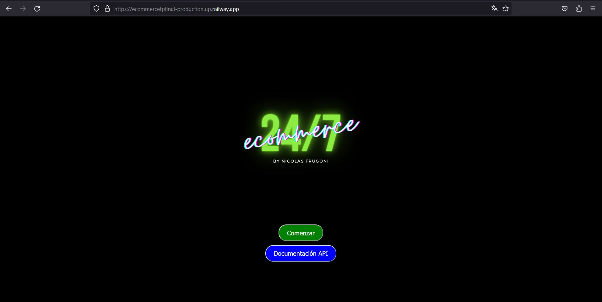
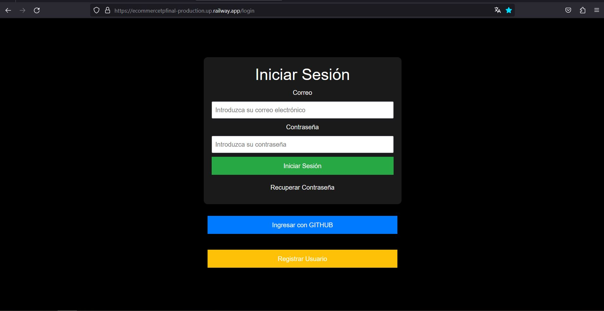
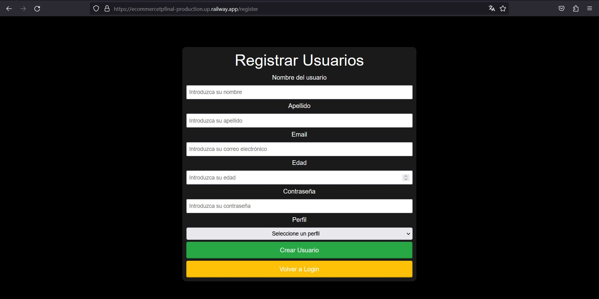
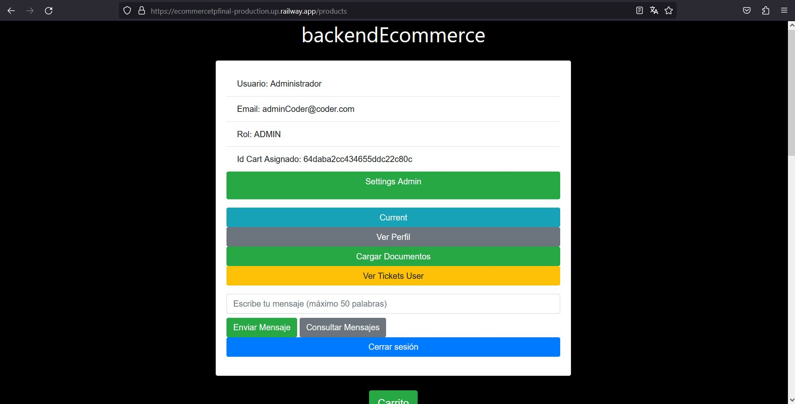
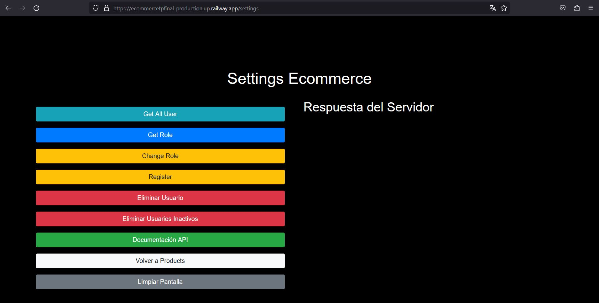
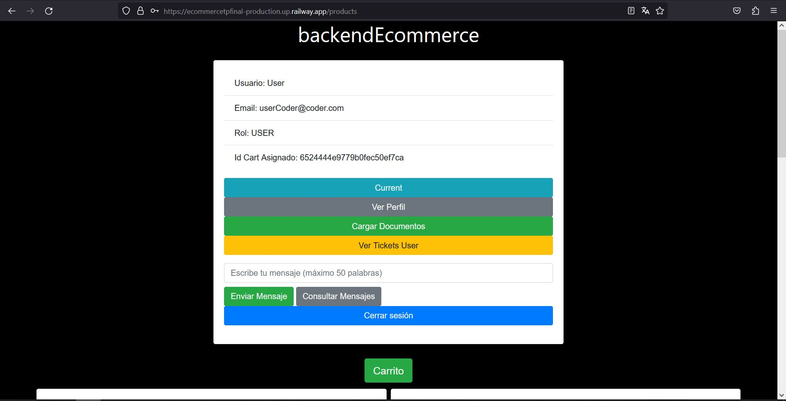
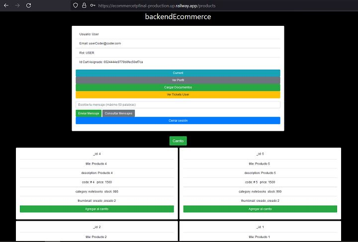
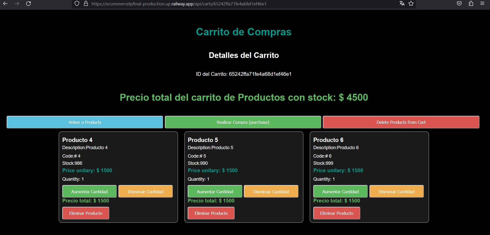

# :handbag:  backendEcommerce
<br/>
<br/>

## :floppy_disk: Versión actual

* 1.0.0 | (12/10/23)

<br/>

## :eyes: Descripción

Es una aplicación backend de una aplicación de e-commerce para comercializar productos con gestión de usuarios, el servidor se basa en un diseño de capas, orientado a MVC y su código contiene las estructuras de programación por parte del lenguaje ECMAScript. 
Se desarrollo con Node.js y de acuerdo con el entorno de ejecución puede utilizar como base de datos MongoDB o Filesystem. 

Este proyecto consiste en la creación de una API REST con la que se pueden realizar todo tipo de acciones como ser:
* Productos: consulta, creación, modificación parcial/total y eliminación
* Carrito de compras: consulta, creación, modificación parcial/total y eliminación parcial/total
* Usuarios: consulta, creación, modificación parcial/total y eliminación
* Upload: carga de archivos
* Email: envió de correo
* Test
* Mensajería 

Además, se podrán registrar usuarios con diferentes niveles de acceso y privilegios ("PUBLIC","USER","ADMIN","PREMIUM")

El servidor se basa en un diseño de 5 capas: routes, controllers, service, respository y dao (managers), además cuanta con validación para los datos de entrada como salida a través del DTO y middlewares

Las vistas están renderizadas con handlebars

Prueba local:  cuenta con tres ambientes:
* Producción: MongoDb
* Producción: Filesystem
* Developer: MongoDb

Prueba deploy:  cuenta con tres ambientes:
* Producción: MongoDb
* Development: MongoDb
* QA:MongoDb

Esta aplicación es de uso educacional prueba. No se autoriza su uso de forma comercial.

<br/>

## :rocket: Deploy

Se realizo el despliegue del aplicativo en la plataforma Railway.app:
* Producción: [enlace](https://ecommercetpfinal-production.up.railway.app/)
* Development:[enlace](https://ecommercetpfinal-development.up.railway.app/)
* QA:[enlace](https://ecommercetpfinal-qa.up.railway.app/)


## :pencil:  Características

<b>Productos:</b>

| Características  |  Disponible   | Descripción  |
|----------|:-------------:|:-------------|
| Agregar un producto | &#10004; | Se puede agregar un producto al sistema. |
| Listar productos | &#10004; | Se pueden listar todos los productos o individualmente por su id. |
| Actualizar productos total| &#10004; | Se pueden actualizar los productos de forma total ya creados. |
| Actualizar productos parcial| &#10004; | Se pueden actualizar los productos de forma total ya creados. |
| Eliminar productos | &#10004; | Es posible eliminar un producto del sistema. |

<b>Carrito:</b>

| Características  |  Disponible   | Descripción  |
|----------|:-------------:|:-------------|
| Crear un carrito | &#10004; | Se puede crear carritos que almacenan productos. |
| Listar carritos | &#10004; | Se pueden listar todos los carritos, por limite o individualmente por su id. |
| Agregar producto | &#10004; | Se pueden agregar productos al carrito. En caso de que el producto ya exista, se agrega una unidad del mismo. |
| Actualizar productos | &#10004; | El contenido del carrito puede ser actualizado de forma completa. |
| Actualizar cantidad | &#10004; | Se puede modificar la cantidad de un producto contenido en el carrito (aumentar/disminuir). |
| Eliminar producto | &#10004; | Es posible eliminar un producto del carrito. |
| Vaciar carrito | &#10004; | Es posible eliminar todos los items del carrito. |
| Finalizar compra | &#10004; | Es posible realizar el proceso de compra total de los productos del carrito. |

<b>User</b>
| Características  |  Disponible   | Descripción  |
|----------|:-------------:|:-------------|
| Registar usuario | &#10004; | Un usuario se puede registar en el sistema. |
| Listar usuarios | &#10004; | Un administrador puede listar a todos los usuarios. |
| Actualizar documentación | &#10004; | Un usuario puede subir documentación para ser validado como premium. |
| Cambiar rol | &#10004; | Un administrador puede cambiar el rol de un usuario entre regular y premium. |
| Eliminar usuarios | &#10004; | Un administrador puede eliminar un usuario del sistema. |
| Eliminar usuarios sin conexión | &#10004; | Un administrador puede eliminar del sistema a los usuarios que no se han conectado en un determinado tiempo. |

<br/>

## :book: Documentación

La documentación de la API e-commerce Backend se la realizó en Swagger. Puede acceder a ella desde [aquí](https://ecommercetpfinal-production.up.railway.app/api/docs/).

<br/>

## :wrench: Instalación

* Decargar/clonar el repositorio
````
npm install
````
* Cargar las dependencias para los entornos

<br/>

## :desktop_computer: Ejecución

* Para ejecutar la aplicación en modo local, con sistema de persistencia basado en base de datos MongoDB, se debe correr el siguiente script:

````
npm run start:mongo
````
* Luego conectarse a la API usando Postman al puerto 8080.
* Nota: los datos de usarios estan detallados en la documentación
<br/>
<br/>
* Para ejecutar la aplicación en modo local, con sistema de persistencia basado en *file system* se debe correr el siguiente script:

````
npm run start:filesystem
````
* Luego conectarse a la API usando Postman al puerto 3000.

<br/>
<br/>
* Para ejecutar la aplicación en modo de desarrollo, con persistencia en base de datos MongoDB diferente a la de producción, se debe correr el siguiente script:

````
npm run start:dev
````
* Luego conectarse a la API usando Postman al puerto 3000.

<br/>

## :test_tube: Testing

* Para realizar un test integral de la API con mocha, chai y supertest, debe:
Abir una terminal nueva y correr la alicacion:

````
npm run start:mongo
````

Abrir a la par otra terminal y ejecutar el test correspondiente:
* Productos: es importate no modificar los parametros del producto _id: 2, ya es el que se utiliza para la prueba
````
npm run test:product
````
* Cart:
````
npm run test:cart
````
* Session:
````
npm run test:session
````

Los test simulan los principales endpoints de cada ruta de la API
Para más detalles referirse a la carpeta '/test'.

<br/>

## :computer: Pantallas sitio Web

* Inicio
Esta pantalla cuenta con dos botones:
-Comenzar: permite ingresar al login para utilizar la aplicación
-Documentación API: redirige a la documentación 



<br/>
<br/>

* Login
Esta pantalla cuenta con varias funciones:
-Ingreso usuarios
-Ingreso con GITHUB
-Redireccionar para registrar usuarios
-Redireccionar para recuperar contraseña



<br/>
<br/>

* Register
Esta pantalla permite registrar los usuarios:



<br/>
<br/>

* Perfil Admin
Una vez logueado el usuario admin cuando se redirige a la vista /products en el panel principal de usuario se habilita un botón que Settings Admin que lo redirigirá a la esta vista para realizar diferentes gestiones



La vista de Settings Admin permite realizar las acciones y visualizar las respuesta del servidor:
-Consultar usuarios
-Consultar role
-Cambiar role
-Registrar usarios
-Eliminar usuarios
-Eliminar usuarios inactivos
-Documentación API
-Volver a vista productos
-Limpiar pantalla: ya que esta pantalla se muestra la respuesta del servidor y esta función permite limpiar la misma


<br/>
<br/>

* Perfil User
Una vez logueado el usuario  cuando se redirige a la vista /products en el panel principal permite realizar diferentes acciones como ser:
-Agregar productos al carrito
-Visualizar los datos del token
-Visualizar los datos de perfil
-Visualizar los tickects de las compras generadas por el user
-Enviar y consultar los mensajes del user



<br/>
<br/>

* Productos
Una vez logueado el usuario  cuando se redirige a la vista /products donde se visualiza:
-Panel con datos y gestión para el usuario
-Carrito: redirige a la vista del carrito para gestionar la compra
-Productos para agregar al carrito



<br/>
<br/>

* Carrito
Esta vista permite:
-Gestionar la compar de los productos
-Aumentar y disminuir cantidad de cada producto
-Eliminar de forma parcial de un producto en el carrrito
-Eliminar todos los productos del carrito



<br/>


## :bust_in_silhouette: Autor

Desarrollado por Nicolás Frugoni
Perfil de github, siga [este](https://https://github.com/nicof31/) enlace.

Para conectar a través de linkendin, presione [aquí](https://www.linkedin.com/in/nicolas-frugoni-1a2770241/?originalSubdomain=ar).# ecommercefinaltp
# tpfinalecommerce
